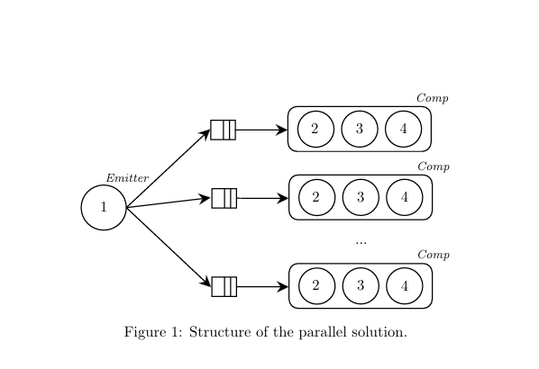

 # The motion detection 
 The motion detection over a single frame can be decomposed into four steps:  (stream parallel compu
tation)
 1. Pick the frame from the input video.
 2. Turn the frame to greyscale.
 3. Smooth the frame.
 4. Detect motion computing the percentage of different pixels between the background picture and
 the frame.
 The sequential solution performs an infinite loop which retrieves the frame from the input video,
 checks if it has motion and stops when the frame retrieved from the video is empty.  
 
 The actual motion detection is implemented by comparing pixel by pixel the frame and the reference
 background picture. 

## Project structure
 The utilities to handle frame capturing, elaboration and motion detection have been implemented into a
 dedicated object MotionDetector.  

 

## Instructions
1. cmake
2. make
3. - sequential_motion_detection path_to_video k
   - pthread_motion_detection path_to_video k pardegree
   - ff_motion_detection path-to-video k pardegree